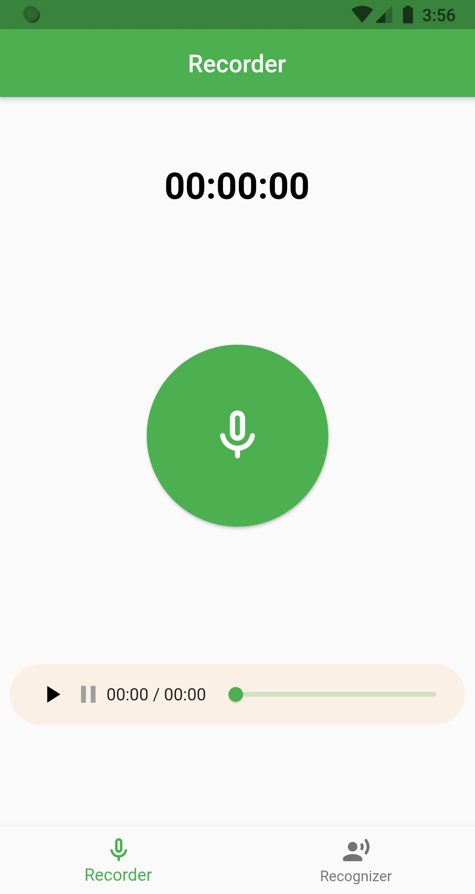
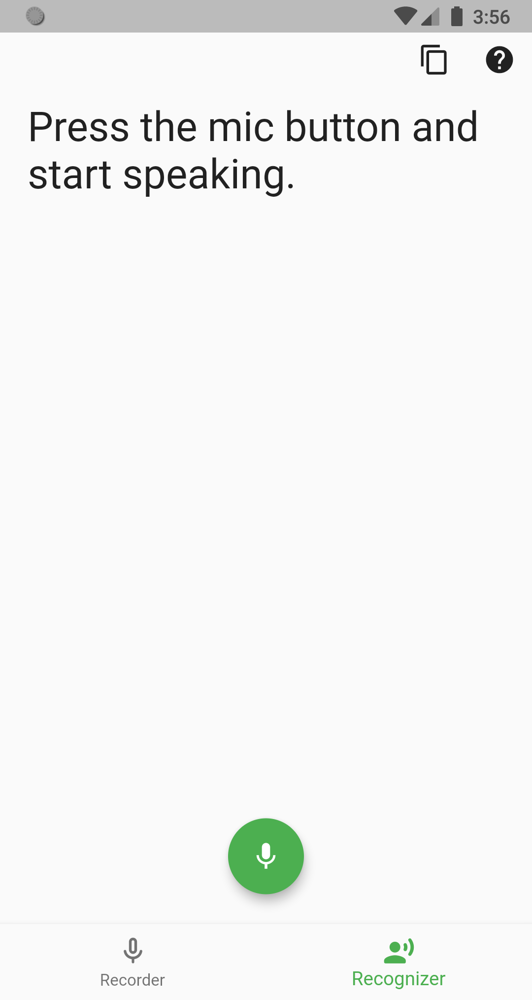

# voice_recorder_recognizer

An audio recorder and speech to text with commands recognition created using Dart Language with Flutter SDK

### Voice Commands
 - Email (Compose email)
 - SMS (Compose message)
 - Map (View map of queried place)
 - Launcher (Open websites or apps)
 - Search (Search result of query from Google Search)

## Preview
### Videos

https://user-images.githubusercontent.com/78299538/127829113-afa72920-7bcd-4b77-8fc9-64833dad3a19.mp4

https://user-images.githubusercontent.com/78299538/127829164-492d1417-d7b0-4cff-acee-da14816a11f2.mp4

### Pictures

#### Bugs
- Some devices specially Chinese market phones doesn't have the Google App installed and sometimes wont get installed on their phones therefore the Speech Recognition Service will not work since it relies on the Google App.
